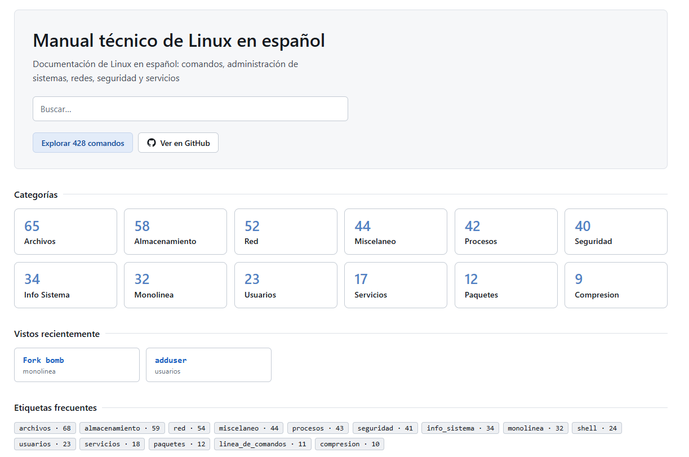

<meta name="description" content="LinuxCore es un repositorio técnico en español sobre Linux, administración de sistemas, seguridad informática, redes, Docker, Kubernetes, Bash, MySQL/MariaDB, almacenamiento, virtualización y DevOps. Documentación práctica para aprender y consultar.">
<meta name="keywords" content="linux, linux tutoriales, administración linux, bash scripting, seguridad informática, redes, docker, kubernetes, mysql, mariadb, almacenamiento, raid, sysadmin, devops, virtualización, forense digital, ssh, openssl, certificados ssl, fundamentos linux, ciberseguridad">
<meta name="robots" content="index, follow, max-image-preview:large, max-snippet:-1, max-video-preview:-1">
<meta name="author" content="Nisamov">
<meta name="theme-color" content="#0969da">
<meta property="og:title" content="LinuxCore - Documentación técnica de Linux, seguridad, redes y administración de sistemas">
<meta property="og:description" content="Repositorio en español con documentación técnica y práctica sobre Linux, administración de sistemas, seguridad, Docker, Kubernetes, Bash, MySQL, redes y virtualización.">
<meta property="og:type" content="website">
<meta property="og:site_name" content="LinuxCore">
<meta property="og:url" content="https://github.com/nisamov/linuxcore">
<meta property="og:image" content="https://raw.githubusercontent.com/nisamov/linuxcore/main/.github/media/top.png">
<meta name="twitter:card" content="summary_large_image">
<meta name="twitter:title" content="LinuxCore - Linux, seguridad y administración de sistemas">
<meta name="twitter:description" content="Documentación técnica en español sobre Linux, seguridad, Docker, Kubernetes, MySQL, Bash, redes y virtualización.">
<meta name="twitter:image" content="https://raw.githubusercontent.com/nisamov/linuxcore/main/.github/media/top.png">
<meta name="twitter:site" content="@nisamov">

  

# Linux Core

   

**Documentación y fundamentos de informática en Español**

> [!IMPORTANT]
> **Repositorio en desarrollo activo:** La estructura de carpetas y la documentación están sujetas a cambios.

## Descripción del Proyecto

**LinuxCore** es un repositorio creado a raíz de su predecesor [LinuxCommands](https://github.com/nisamov/LinuxCommands), con el fin de consolidar años de experiencia en sistemas Linux, arquitectura de computadores, prácticas de seguridad e infraestructuras modernas.

El objetivo es proporcionar el contexto técnico necesario para comprender no solo cómo utilizar una herramienta, servicio o protocolo, sino también el porqué de su funcionamiento y en qué escenarios debe aplicarse.

El contenido se desarrolla en español y está orientado tanto al aprendizaje estructurado como a la consulta técnica rápida.

> [!NOTE]
> **Base de datos exportable**
> El proyecto distribuye la referencia de comandos en formato **JSON**, optimizada para alimentar el sitio web **[linuxcore.site](https://linuxcore.site)** o para tus propias automatizaciones. 
>
> __Descargar la última versión compilada:__ 

## Estructura de Contenidos

| Directorio | Propósito | Contenido Destacado |
| --- | --- | --- |
| **`base_de_datos/`** | Conceptos y administración de sistemas de bases de datos relacionales. | Teoría de BDD, MySQL/MariaDB (ejercicios, administración, copias de seguridad, *joins*). |
| **`comandos/`** | Diccionario técnico estructurado en JSON de utilidades de terminal Linux. | Categorías (red, seguridad, almacenamiento, usuarios) y comandos rápidos (*one-liners*). |
| **`conceptos/`** | Fundamentos sobre virtualización y entornos de ejecución. | Hipervisores, máquinas virtuales, Proxmox, VirtualBox y Hyper-V. |
| **`fundamentos/`** | Bases conceptuales del sistema operativo Linux y almacenamiento. | Permisos (ACLs), estados de procesos, distros Linux, niveles de RAID. |
| **`hardware/`** | Especificaciones y teoría sobre componentes físicos del sistema. | Memorias RAM y arquitectura física de almacenamiento. |
| **`infraestructura/`** | Despliegue de aplicaciones y tecnologías de virtualización ligera. | Docker (teoría e instalación) y Kubernetes. |
| **`procedimientos/`** | Guías prácticas paso a paso para *troubleshooting* y administración. | Recuperación de FS, generación de certificados RSA/SSL, diagnóstico de SSH, red y CPU. |
| **`programacion/`** | Desarrollo de scripts, lenguajes web y lógica de base de datos. | Scripts en Bash, fundamentos de PHP y sintaxis SQL en MariaDB. |
| **`protocolos/`** | Especificaciones teóricas y configuraciones de red multinivel. | Funcionamiento y alta disponibilidad (*failover*) de DHCP y Kea DHCP. |
| **`redes/`** | Principios de conectividad y diseño de infraestructura de red. | Mapeo de puertos y topologías de red. |
| **`referencias/`** | Plantillas de configuración reales listas para entorno de producción. | Archivos de zona BIND9 (DDNS), `smb.conf`, reglas `nftables` y servicios `systemd`. |
| **`seguridad/`** | Análisis defensivo, ofensivo, criptografía y análisis forense. | Algoritmos de hash, cifrado SSL/SSH, auditoría con `auditd` y herramientas forenses (`foremost`). |
| **`servicios/`** | Configuración y gestión de demonios, servidores y bases de datos. | Servidores web (Nginx, Apache), BDD (Redis, PostgreSQL), Cron y Journald. |

## LinuxCore.site

  

  <a href="https://linuxcore.site/">
    <strong>↗ Abrir LinuxCore Web</strong>
  </a>

## Colaboradores

  

**¿Deseas contribuir?**  
Este proyecto nace con fines de aprendizaje y referencia técnica. Si encuentras alguna errata, quieres corregir un procedimiento o añadir nuevo contenido, ¡las contribuciones son más que bienvenidas! Abre un [Issue](https://github.com/nisamov/linuxcore/issues) o envía un [Pull Request](https://github.com/nisamov/linuxcore/pulls).

  
<b>Linux Core - Nisamov | MIT License - 2026</b>

  
<b>Contacto:</b> <a href="mailto:nisamov.contact@gmail.com">nisamov.contact@gmail.com</a>

  

    
  

